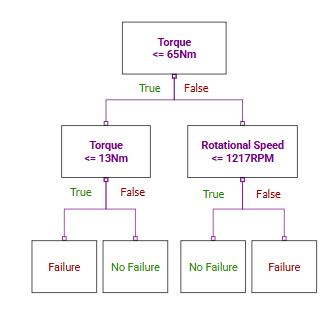
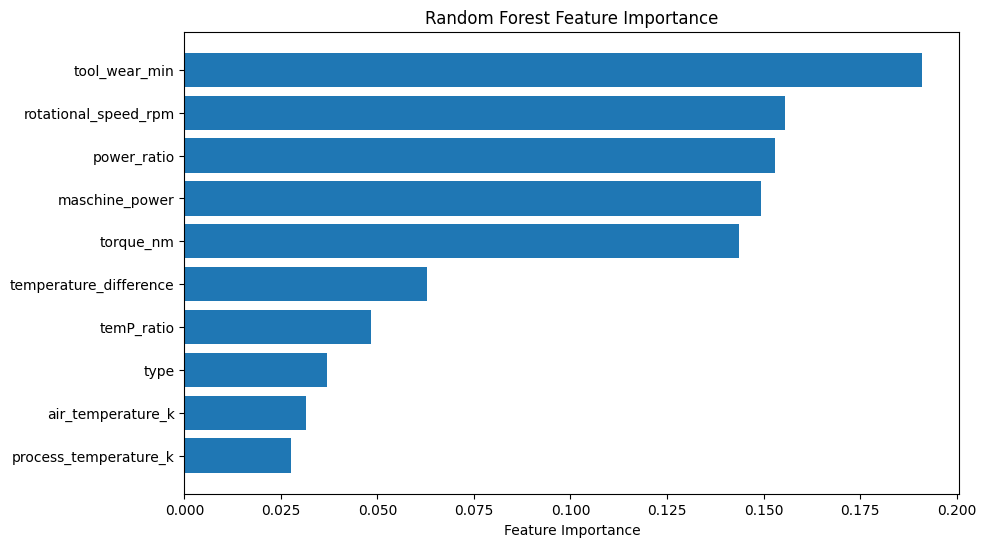
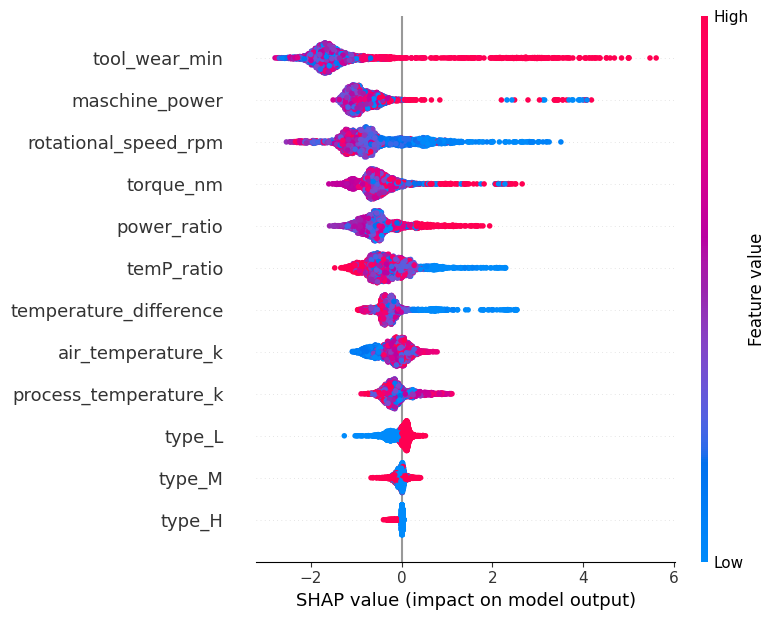
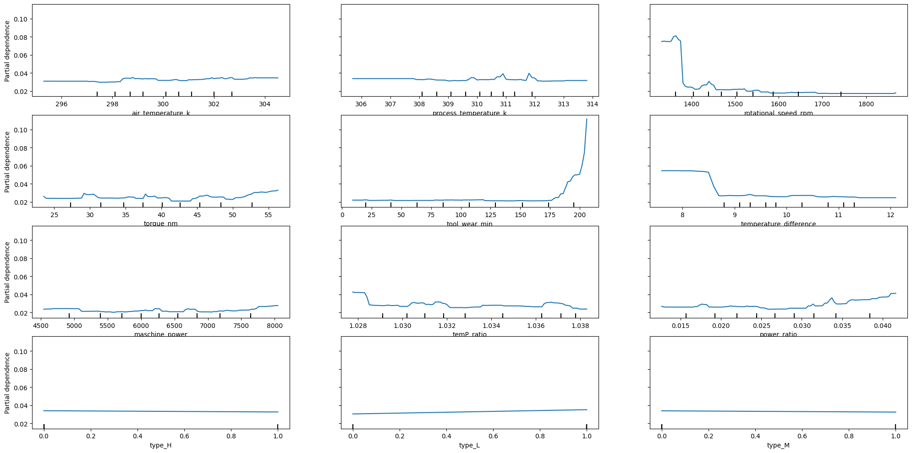
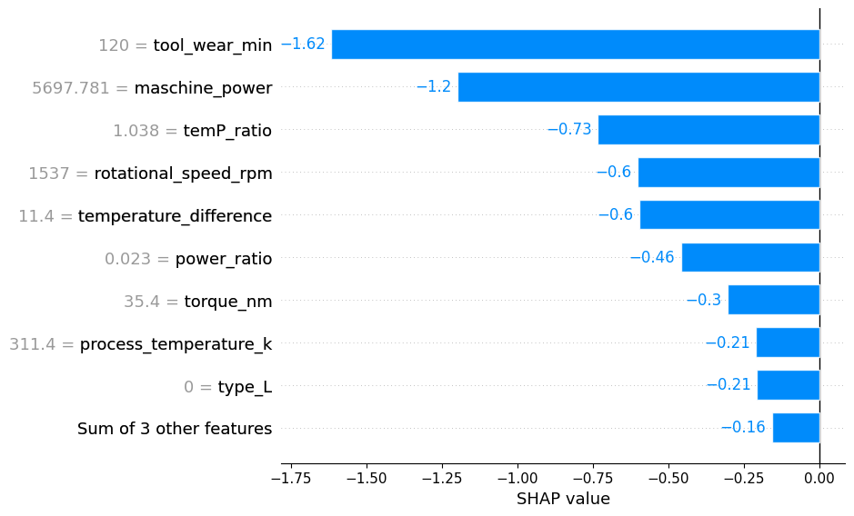
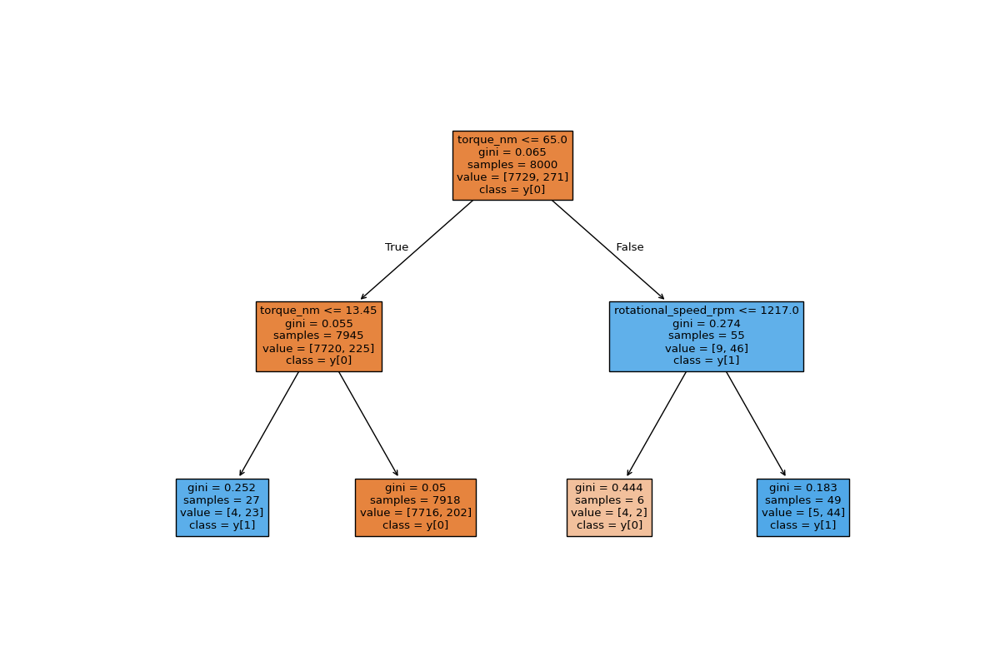

# Digital Twin-Driven Predictive Maintenance Model for Industrial Machines

This project develops a Digital Twin–driven predictive maintenance model that estimates machine failure risk based on operational conditions such as temperature, torque, rotational speed, and tool wear.  
The model enables maintenance engineers and managers to simulate scenarios, understand feature influence using SHAP explanations, and optimize maintenance decisions to reduce production risk.

---

## Value Proposition

A Digital Twin–based Predictive Maintenance System that can:

- Simulate machine operating conditions (temperature, speed, torque, tool wear)
- Simulate machine failure to understand the boundary between normal and faulty operation
- Provide interpretable SHAP explanations to identify which features drive the failure risk
- Allow managers to test “What-if” scenarios  
  (e.g., *What if we increase the load? What if the temperature rises by 20°C?*)
- Reduce production risks and support smarter maintenance scheduling

---
## Project Structure (Which files to use)

### Run the Streamlit App
- main_code folder: main coiding file *"`digital_twin_ml_modeling.ipynb`"* is stored 
- Streamlit App to run: `st_app.py`
- Helper functions: `st_function.py`
- other_modeling_approachs : Folder contains different ML models
- README file : Project information
- requirements file : Python packages requirements
- techical_documentation : Technical details of project
- ..project_presentation/Final_PPT_DigitalTwin.pdf : Final presentation of the project

---
##  Hypotheses

The following hypotheses guided our project:

1. Higher `tool_wear_min` values increase the probability of machine failure.
2. Large `temperature_difference` between process and ambient air correlates with higher failure risk.
3. Ensemble models like Random Forest outperform a single Decision Tree in predictive accuracy due to reduced overfitting.
4. A small, interpretable Decision Tree (2 features, max depth=2) can provide human-understandable rules for maintenance decisions.
5. Simulating different operational scenarios (e.g., increased load or speed) will meaningfully change the predicted risk scores.

---

##  Dataset Overview

The dataset contains machine condition measurements, operational metadata, and failure indicators.

### **Original Features**

- `udi` – Unique record ID  
- `product_id` – Machine/product identifier  
- `type` – Machine type (H, L, M)  
- `air_temperature_k` – Air temperature in Kelvin  
- `process_temperature_k` – Process temperature in Kelvin  
- `rotational_speed_rpm` – Spindle/shaft rotational speed  
- `torque_nm` – Applied torque in Newton-meters  
- `tool_wear_min` – Tool wear in minutes  

### **Original Failure Signals (Binary Labels)**  
(Used to engineer the final target)

- `twf` – Tool Wear Failure  
- `hdf` – Heat Dissipation Failure  
- `pwf` – Power Failure  
- `osf` – Overstrain Failure  
- `rnf` – Random Failure  

### **Engineered Features**

- `temperature_difference` – Δ between process & air temperature  
- `maschine_power` – Torque × rotational speed  
- `temp_ratio` – Ratio of air/process temperature  
- `power_ratio` – Ratio of machine power to designed performance  

### **Target**

- `machine_failure` – Binary target: 1 = failure, 0 = normal

---
##  Data Pipeline

The data pipeline ensures reproducible and efficient data handling for all machine learning models:

1. **Raw Data Ingestion:**  
   All raw sensor and machine operation data are stored in `data/raw/` (CSV, etc.).

2. **Preprocessing & Feature Engineering:**  
   - Cleaning missing values  
   - Creating engineered features such as `temperature_difference`, `maschine_power`, `power_ratio`  
   - Encoding categorical features using OneHotEncoder  
   - Scaling numeric features

3. **Processed Data Storage:**  
   Final cleaned and processed datasets are stored in `data/processed/`. (leave as future work)

4. **Centralized Database (DuckDB):**  
   All  data are written to `data/team_data.duckdb`.  
   Machine learning models retrieve data directly from this database for training and evaluation.

> This setup allows reproducibility, smooth experimentation, and easy updates for multiple models.

---

##  Methods Used

- Exploratory Data Analysis (EDA)  
- Missing value analysis  
- Feature Engineering  
- Categorical encoding using OneHotEncoder  
- Scaling numeric features  
- Train-test split  
- Machine learning model: Random forest Classifier, XGBoostClassifier, Neural network and Decision Tree als Baseline  
- Model explainability: SHAP  
- Partial Dependence Plots (PDP)  
- Evaluation using Precision, Recall, **F1**

---

## Model Description

Four different machine learning models were developed and evaluated to predict machine failure risk.  
The goal was to compare baseline, tree-based, and neural network approaches to identify the best-performing algorithm for predictive maintenance.
We intentionally started with a **human-interpretable baseline model** before moving to more complex algorithms.  
This ensures transparent decision-making in critical industrial applications.

### **1. Baseline Model: Interpretable Decision Tree (Depth = 2, 2 Features)**

To establish a transparent benchmark, we trained a very small **Decision Tree**:

- **max_depth = 2**  
- **only 2 features** were used (the most influential according to initial analysis):
  - `torque_nm`
  - `rotational_speed_rpm`

 **Purpose:**  
Provide a *human-level interpretable model* that maintenance engineers can understand without ML background.

🛠 Why this approach:
- Each decision path corresponds to a simple rule  
  → e.g., *“If torque > X and speed > Y, risk increases.”*  
- Allows domain experts to validate whether the splits make physical sense  
- Serves as a logic-based baseline to compare more complex models  

Although accuracy was limited, this model provides:
- maximum interpretability  
- insights into fundamental feature thresholds  
- a sanity check before moving on to advanced models

---

### **2. Random Forest (Final Model)**
Random Forest was the **best-performing model** and became the final choice.

Reasons for superior performance:
- strong generalization through bagging  
- low variance compared to a single tree  
- robustness to noisy sensor data  
- excellent performance in F1-score  

Random Forest was the most stable and reliable across all validation folds.

---

### **3. XGBoost**
XGBoost offered strong performance and captured non-linear relationships well.  
However:

- required more tuning  
- slightly less stable than RandomForest on imbalanced data  
- more sensitive to hyperparameters  

It performed close to RandomForest but did not surpass it consistently.

---

### **4. Neural Network (MLP)**
A Multi-Layer Perceptron (MLP) was trained as a deep learning baseline.

Key characteristics:
- Able to learn non-linear relationships  
- Requires scaling + careful tuning  
- Sensitive to noise and imbalanced data
- required more data to generalize    
  
The NN performed reasonably well but did not outperform the tree-based models,in precision-recall metrics.

It served as a useful comparison but was not selected as the final model.

---

### **Final Choice**
The **Random Forest** was selected as the final predictive maintenance model due to:

- best f1_score  
- high robustness  
- interpretable feature importance  
- strong performance without overfitting  

The simple interpretable Decision Tree remains a valuable reference model to ensure transparency and trust. 
  

The model predicts a **risk score** representing the probability of machine failure under given operating conditions.

---

## Evaluation Metrics

The target of the model is to correctly classify whether there will be a failure, hence it is the target (failure = 1).
We want the model to:
- maximize identification of failures by minimizing "false negatives" (recall)
- maximize tool run-time by minimizing "false positives" (precision)
We will therefore go with the **F1 score** as it provides a balance between recall and precision.

Key metrics used:

- **AUC-PR** – recommended for imbalanced classification   
- **F1-Score**  
- **SHAP Summary Plots**  
- **PDP Plots** for feature influence

-> **Precision (Positive Predictive Value)**

$$
\text{Precision} = \frac{TP}{TP + FP}
$$

Where:  
- $TP$ = True Positives  
- $FP$ = False Positives

-> **Recall (Sensitivity / True Positive Rate)**

$$
\text{Recall} = \frac{TP}{TP + FN}
$$

Where:  
- $FN$ = False Negatives

-> **F1-Score**

$$
F1 = 2 \cdot \frac{\text{Precision} \cdot \text{Recall}}{\text{Precision} + \text{Recall}}
$$

---

## 📊 Results / Visualizations

The following visualizations summarize the performance and explainability of the predictive maintenance models:

---

### **1️⃣ Model Performance**

**Model Comparison Table / Barplot**  
- Compares AUC-PR, Precision, Recall, and F1-score for all four models:  
  - Decision Tree (baseline)  
  - Random Forest (final)  
  - XGBoost  
  - Neural Network  

---

### **2️⃣ Feature Importance & Explainability**

**Random Forest Feature Importance (Barplot)**  
- Shows which features most influence predictions.  
- Example features: `torque_nm`, `rotational_speed_rpm`, `tool_wear_min`, `temperature_difference`.

**SHAP Summary Plot**  
- Displays global feature influence on model predictions.  
- Color indicates whether a high feature value increases or decreases failure risk.

**Partial Dependence Plots (PDPs)**  
- Visualize the effect of top features on predicted failure probability.  
- Useful for “What-if” analysis: e.g., *how does increasing torque affect risk?*

**SHAP Force Plot**  
- Shows local explanations for individual machine observations.  
- Can help engineers understand why a machine is predicted to fail.

---

### **3️⃣ Baseline Model Visualizations**

**Decision Tree (Depth=2, 2 Features)**  
- Human-interpretable rules for maintenance decisions.  
- Example:  
  - *If `torque_nm > 150` and `rotational_speed_rpm > 5000` → higher failure risk.*  
- Demonstrates transparency and explains basic decision logic.

---

### **Notes**

- Only key plots are included in the README for clarity.  
- Detailed plots (all SHAP force plots, PDPs for all features) are included in the **notebooks** or **technical documentation**.  
- Visualizations support **interpretability, scenario simulation, and model validation** for industrial maintenance decisions.

---
## Interactive Dashboard

**Streamlit dashboard implemented**:

- Modify input features (torque, speed, temperature)  
- Visualize predicted failure risk scores in real-time  
- Helps engineers and managers make informed maintenance decisions

---

## Future Work

- Integrate real-time sensor timestamps for temporal modeling  
- Explore LSTM / Temporal CNN models for sequential prediction  
- Expand digital twin simulation with physics-based models

---

